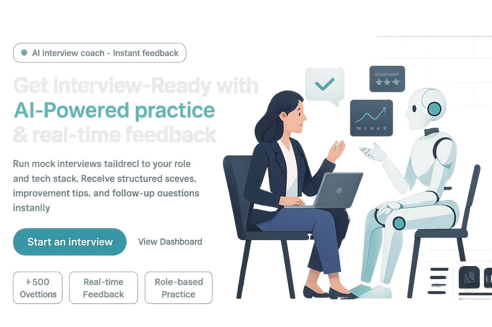

# InterviewAI – AI-Powered Interview Practice Platform

> An intelligent AI-driven interview preparation platform built with **Next.js**, **Firebase**, and **Vapi**, allowing users to practice mock interviews with instant feedback and real-time conversation.

---

## 📌 Overview
**InterviewAI** is a web-based AI interview assistant that:

- Guides users to create **custom AI interviewers** for specific job roles.
- Conducts **interactive AI interviews** in real time.
- Generates **personalized feedback** with scores and suggestions.
- Stores interview data for later review.

The project integrates **[Vapi](https://vapi.ai)** to handle **AI-driven conversation flows** and **API calls** for interview creation and execution.

---

## 🛠️ Tech Stack
- **Frontend:** Next.js (React + Tailwind CSS)
- **Backend:** Firebase Authentication + Firestore
- **AI Integration:** Vapi
- **Styling:** Tailwind CSS, custom components
- **Form Handling:** React Hook Form + Zod
- **Deployment:** Vercel

---

## 📂 Features
- **User Authentication** (Email/Password + OAuth)
- **AI Interviewer Setup**
  - Role
  - Type (technical, behavioral, mixed)
  - Difficulty level
  - Tech stack
  - Number of questions
- **Real-time Conversation**
  - AI interviewer asks questions
  - User responds via microphone
- **Feedback Generation**
  - Score out of 100
  - Detailed feedback on answers
- **Dashboard & History**
  - View past interviews
  - Revisit feedback anytime

---

## 🚀 How It Works
The core interview flow is powered by **Vapi's conversation nodes**.

### 1️⃣ Start Node
The **Conversation Node** greets the user and collects the required variables:
- `role`
- `type`
- `level`
- `amount`
- `techstack`

### 2️⃣ Conditional Check
If all variables are provided, proceed to the interview generation step.

### 3️⃣ Confirmation Conversation
AI confirms:

### 4️⃣ API Request
Calls backend API with the provided variables to:
- Generate interview questions
- Store them in the database

### 5️⃣ End Call
AI ends the conversation:

User is redirected to the dashboard.

---


## 📊 Vapi Flow Screenshot
Below is the visual conversation flow in **Vapi**:


---

## ⚙️ Installation & Setup

### 1. Clone the Repository
```bash
git clone https://github.com/yourusername/interviewai.git
cd interviewai

2. Install Dependencies
bash
Copy
Edit
npm install
3. Environment Variables
Create a .env.local file:

env
Copy
Edit
NEXT_PUBLIC_VAPI_API_KEY=your_vapi_key
NEXT_PUBLIC_FIREBASE_API_KEY=your_firebase_api_key
NEXT_PUBLIC_FIREBASE_AUTH_DOMAIN=your_project.firebaseapp.com
NEXT_PUBLIC_FIREBASE_PROJECT_ID=your_project_id
NEXT_PUBLIC_FIREBASE_STORAGE_BUCKET=your_project.appspot.com
NEXT_PUBLIC_FIREBASE_MESSAGING_SENDER_ID=your_sender_id
NEXT_PUBLIC_FIREBASE_APP_ID=your_app_id
4. Run the Development Server
bash
Copy
Edit
npm run dev
Visit: http://localhost:3000

🧪 Usage
Sign In or Sign Up.

Start an AI Interview:

Choose job role, type, level, and tech stack.

Answer Questions in Real-Time.

Receive Feedback instantly.

View History in dashboard.

💡 Practical Vapi Usage in Code
Example integration with Vapi SDK:

javascript
Copy
Edit
import { vapi } from '@/lib/vapi';

await vapi.start(
  process.env.NEXT_PUBLIC_VAPI_WORKFLOW_ID,
  {
    variableValues: {
      role: 'Frontend Developer',
      type: 'Technical',
      level: 'Mid',
      amount: 5,
      techstack: 'React, TypeScript'
    }
  }
);
📄 License
MIT License © 2025 [Praharsh Pranjal]
